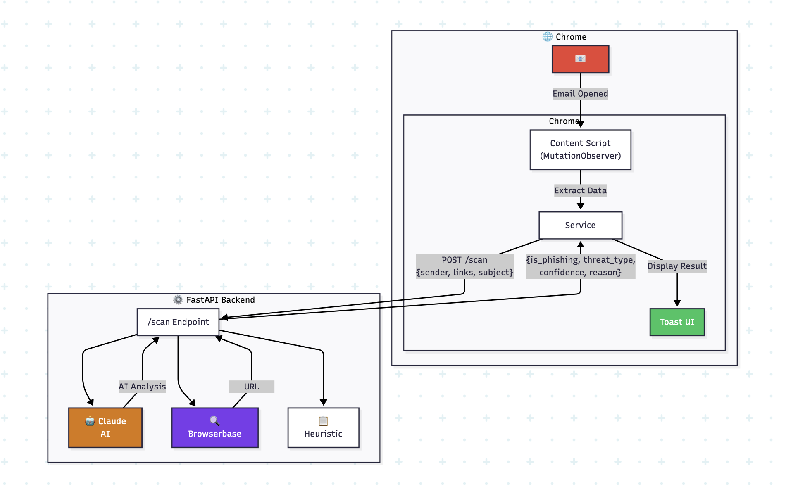

# Phishing Shield

**Real-time AI-powered threat detection for Email**

Detects: **Phishing** | **Tech Support Scams** | **Scareware**

## How Does It Work?

When you open an email in Gmail, the Chrome extension automatically extracts the sender, subject, and any links from the email body. This data is sent to a local FastAPI backend, which uses Claude AI to analyze the content and classify it as phishing, tech support scam, scareware, or safe. A toast notification appears showing the result with a color-coded threat level.

**Future Enhancement:** Browserbase integration for deep URL inspection to detect malicious redirects and credential-harvesting pages.

## System Architecture



## Features

| Feature | Description |
|---------|-------------|
| **Real-Time Detection** | Auto-detects new emails using MutationObserver |
| **AI Analysis** | Claude AI classifies threats with confidence scores |
| **Threat Types** | Phishing (Red), Tech Support (Yellow), Scareware (Purple), Safe (Green) |
| **Fallback** | Local heuristic analysis if API is unavailable |
| **Non-Blocking** | Background service worker keeps UI responsive |

## Quick Start

### Prerequisites

- Python 3.10+
- Google Chrome
- Anthropic API Key

### Backend Setup

```bash
# Create virtual environment
python -m venv venv
source venv/bin/activate

# Install dependencies
pip install -r requirements.txt

# Set API key
export ANTHROPIC_API_KEY="your-api-key"

# Run server
python main.py
```

### Chrome Extension Setup

1. Go to `chrome://extensions/`
2. Enable **Developer mode**
3. Click **Load unpacked** → Select `extension` folder

## How to Test

1. Start the backend server (`python main.py`)
2. Load the extension in Chrome
3. Open Gmail and click on any email
4. Watch for the toast notification showing the scan result

### Test via API

```bash
# Test phishing detection
curl -X POST http://localhost:8000/scan \
  -H "Content-Type: application/json" \
  -d '{
    "sender_email": "security@paypa1.com",
    "links": ["http://paypa1-verify.tk/login"],
    "email_subject": "Verify Your Account Now"
  }'
```

## API Reference

### POST /scan

**Request:**
```json
{
  "sender_email": "support@example.com",
  "links": ["http://suspicious-link.tk"],
  "email_subject": "Account Verification",
  "email_snippet": "Click here to verify..."
}
```

**Response:**
```json
{
  "is_phishing": true,
  "threat_type": "phishing",
  "confidence": 0.87,
  "reason": "Suspicious domain; credential harvesting attempt"
}
```

### GET /health

Returns server status and API configuration.

## Environment Variables

| Variable | Required | Description |
|----------|----------|-------------|
| `ANTHROPIC_API_KEY` | Yes | Anthropic API key for Claude |
| `BROWSERBASE_API_KEY` | No | For URL inspection (future) |
| `BROWSERBASE_PROJECT_ID` | No | Browserbase project ID |

## Tech Stack

- **Backend:** Python FastAPI
- **AI:** Claude Sonnet (Anthropic)
- **Frontend:** Chrome Extension (Manifest V3)
- **Email Support:** Gmail, Outlook Web
